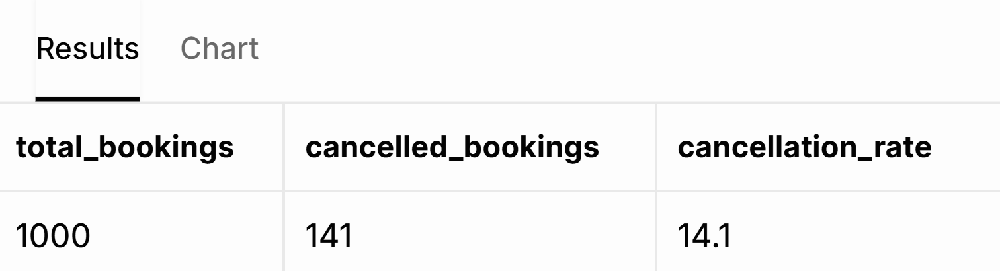

# Travel Booking Cancellation & Customer Experience Analysis

## Executive Summary

This project analyses travel booking data to understand cancellation behaviour and customer experience.

Using SQL, I explored 1,000 travel bookings to investigate booking patterns, cancellation behaviour, booking value, discounts and customer ratings. The analysis was designed to identify patterns that could support better booking management and customer experience decisions.

The analysis was then visualised in Tableau to communicate the findings clearly to business stakeholders.

## Business Problem

A travel booking company wants to understand why some bookings are cancelled and whether booking characteristics are associated with different customer experiences.

The company wants to use its booking data to identify patterns that could support better booking management and customer experience decisions.

### Key Business Questions

1. What does overall booking performance look like?
2. Which destinations and travel characteristics are associated with higher cancellation rates?
3. Is booking value associated with cancellation behaviour?
4. How does cancellation behaviour vary across different discount levels?
5. Which travel characteristics are associated with different customer ratings?


## Dataset

The dataset contains **1,000 travel booking records** across **29 variables**.

The data includes information relating to:

| Category | Example Variables |
|---|---|
| Customer | Age, gender, country |
| Booking | Booking date, travel date, booking status |
| Destination | Destination city, destination country |
| Accommodation | Hotel, hotel rating, rooms |
| Trip | Number of travellers, number of nights, meal plan |
| Financial | Discount amount, total trip cost |
| Customer Experience | Customer rating, review |
| Cancellation | Cancellation status, cancellation reason |
| Transportation | Transportation type |

The dataset was used to investigate booking performance, cancellation behaviour, financial impact and customer experience.


## Data Exploration

Before carrying out the business analysis, the dataset was explored to understand its structure and check for potential data quality issues.

The initial exploration focused on:

- Confirming the total number of bookings
- Checking for duplicate Booking IDs
- Reviewing cancellation status
- Reviewing key booking and customer experience fields
- Validating the data before carrying out further analysis

### Initial Checks

| Check | Result |
|---|---:|
| Total bookings | 1,000 |
| Duplicate Booking IDs | 0 |

These checks confirmed that the dataset contained 1,000 booking records and no duplicate Booking IDs were identified.


## Methodology

The analysis followed a structured process using SQL to explore the booking data and Tableau to visualise the findings.

### Analysis Process

1. **Data validation** – Checked the dataset structure, record count and duplicate Booking IDs.
2. **Data exploration** – Reviewed booking, cancellation, financial and customer experience variables.
3. **Descriptive analysis** – Calculated counts, averages, totals and cancellation rates.
4. **Grouping and segmentation** – Compared results across destinations, transportation, lead time, trip value, discounts and customer experience factors.
5. **Comparative analysis** – Compared cancellation rates and customer ratings across different booking characteristics.
6. **SQL analysis** – Used PostgreSQL/Supabase to answer the key business questions and identify patterns in the data.
7. **Tableau visualisation** – Created charts and a dashboard to communicate the key findings clearly.
8. **Business interpretation** – Considered what the findings could mean for booking management and customer experience.

### SQL Techniques Used

- `COUNT()`
- `SUM()`
- `AVG()`
- `GROUP BY`
- `WHERE`
- `CASE WHEN`
- Common Table Expressions (CTEs)
- Conditional aggregation
- Percentage calculations
- Filtering and sorting

### Tools

- **PostgreSQL / Supabase** – Data analysis and SQL queries
- **Tableau** – Data visualisation and dashboard development


## SQL Business Analysis

### Analysis 1 — Cancellation Analysis

#### Business Question

How common are booking cancellations, what are the main reasons customers cancel, and what patterns can be identified in cancellation behaviour?

Understanding cancellation behaviour can help the business identify areas where booking processes, communication or customer support could potentially be improved.

#### SQL Query — Overall Cancellation Rate

```sql
SELECT
    COUNT(*) AS total_bookings,
    SUM(
        CASE
            WHEN "Cancellation_Status" = 'Cancelled' THEN 1
            ELSE 0
        END
    ) AS cancelled_bookings,
    ROUND(
        100.0 * SUM(
            CASE
                WHEN "Cancellation_Status" = 'Cancelled' THEN 1
                ELSE 0
            END
        ) / COUNT(*),
        1
    ) AS cancellation_rate
FROM travel_bookings;




#### Result

The dataset contains 1,000 bookings, of which 141 were cancelled. This represents an overall cancellation rate of **14.1%**.

#### What does it tell us?

Approximately 1 in 7 bookings in the dataset were cancelled. This provides a baseline for comparing cancellation patterns across different booking characteristics.

#### Why does it matter to the business?

Cancellation volume represents a potential operational and financial concern. Monitoring the cancellation rate can help the business understand where cancellations are concentrated and identify areas for further investigation.

#### SQL Query — Cancellation Reasons

```sql
SELECT
    "Cancellation_Reason",
    COUNT(*) AS cancelled_bookings
FROM travel_bookings
WHERE "Cancellation_Status" = 'Cancelled'
GROUP BY "Cancellation_Reason"
ORDER BY cancelled_bookings DESC;


